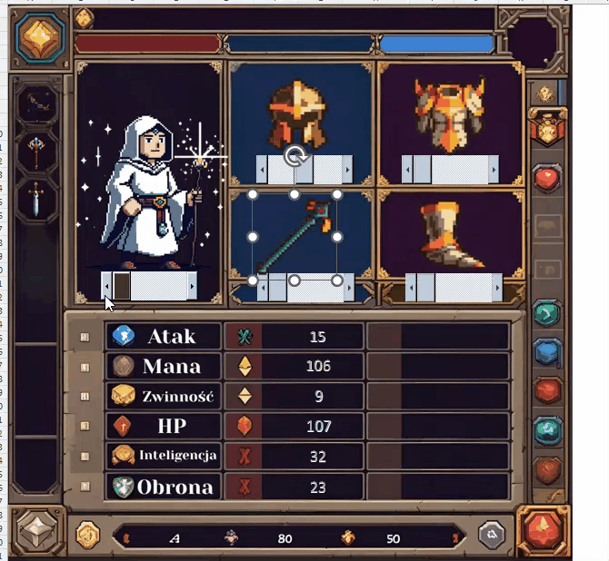

# Interactive RPG Character Creator & Stat Engine (MS Excel & VBA)

##  O projekcie
Zaawansowany, interaktywny kreator postaci RPG zrealizowany w całości w programie MS Excel z wykorzystaniem języka **VBA (Visual Basic for Applications)**. Projekt łączy logikę relacyjnych baz danych z dynamicznym renderowaniem grafiki (Pixel-Art HUD) oraz zaawansowanym silnikiem kalkulacji statystyk w czasie rzeczywistym.

##  Architektura i Funkcjonalność systemu
*   **Dynamiczny Podgląd Wyposażenia (Visual HUD):** System automatycznego renderowania i podmiany obiektów graficznych (postać, hełm, zbroja, broń, buty) na podstawie wyborów użytkownika z poziomu kontrolek arkusza.
*   **Relacyjna Baza Danych (Arkusz Słownikowy):** Struktura danych oparta na podziale na dwa arkusze. Cały zestaw danych przedmiotów i klas (Mag, Wojownik, Łucznik) oraz ich modyfikatory cech są mapowane dynamicznie z bazy danych zlokalizowanej w drugim arkuszu.
*   **Zdarzeniowy Silnik Statystyk (Real-time Calculation Engine):** Skrypty VBA automatycznie reagują na zmianę ekwipunku, czyszczą stare modyfikatory i obliczają ostateczne wartości bojowe postaci:
    *   Punkty Życia (HP)
    *   Punkty Many (Mana)
    *   Atak oraz Obrona
    *   Zwinność i Inteligencja
*   **Algorytm Walidacji Klas (Class Constraints):** Logika backendowa blokuje lub optymalizuje dobór dedykowanego uzbrojenia (np. łuki dla Łucznika, kostury dla Maga), dopasowując ujemne lub dodatnie modyfikatory cech z bazy danych przedmiotów.

## Wykorzystane technologie i mechanizmy
*   **Backend:** VBA (Procedury obsługi zdarzeń `Worksheet_Change`, manipulacja kolekcjami obiektów typu `Shapes`, zaawansowane wyszukiwanie i mapowanie danych).
*   **Frontend / UI:** MS Excel Custom UI Design, zaawansowane formatowanie warunkowe, integracja grafik warstwowych (Pixel-Art assets).
*   **Logika Danych:** Relacyjne tablice danych, dynamiczne odwołania indeksowane i dynamiczne filtrowanie rekordów przedmiotów.

